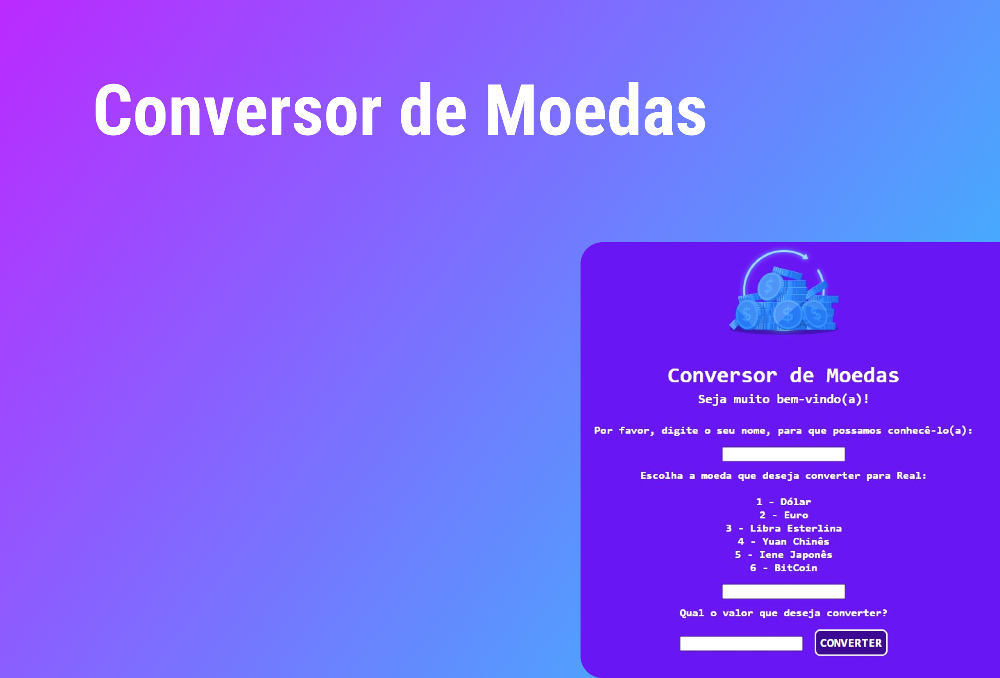

<h1 align="center"> Conversor de Moedas </h1>

Página criada para converter moedas.

  <a href="#-tecnologias">Tecnologias</a>&nbsp;&nbsp;&nbsp;|&nbsp;&nbsp;&nbsp;
  <a href="#-projeto">Projeto</a>&nbsp;&nbsp;&nbsp;|&nbsp;&nbsp;&nbsp;
  <a href="#-layout">Layout</a>&nbsp;&nbsp;&nbsp;|&nbsp;&nbsp;&nbsp;
  <a href="#memo-licença">Licença</a>

  

 

  

## 🚀 Tecnologias

Esse projeto foi desenvolvido com as seguintes tecnologias:

- HTML e CSS
- JavaScript
- Git e Github
- Figma

## 💻 Projeto

O conversor de moedas é capaz de converter 6 moedas importantes no mercado mundial para seu valor em reais, facilitando o processo de compra de produtos, passagens aéreas para o exterior etc.

Você pode ter acesso ao projeto online [clicando aqui](https://toddynan.github.io/ConversorDeMoedas).

## 🔖 Layout

Você pode visualizar o layout do projeto através [DESSE LINK](https://www.figma.com/file/IuN6QGzo6odpYvjngJPJDs/DevLinks-(Community)?node-id=10%3A620&t=sEaYoB98B1SWJTkc-0). É necessário ter uma conta no [Figma](https://figma.com) para acessá-lo.

## :memo: Licença

Esse projeto está sob a licença MIT.

---

Powered by Alura :wave: